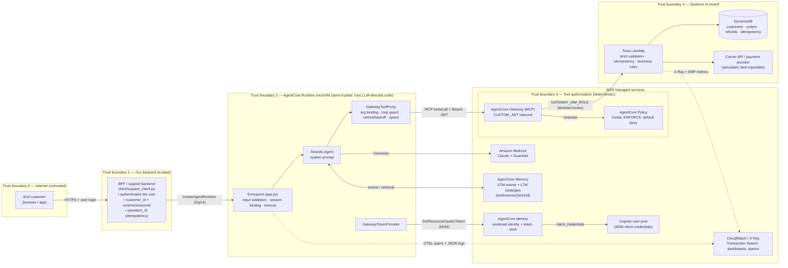
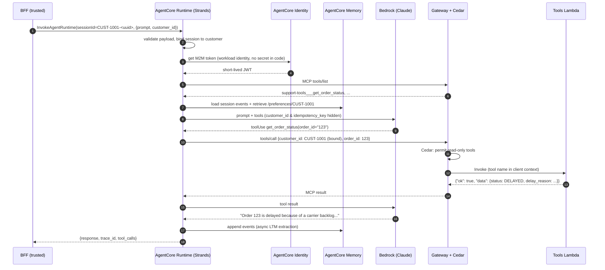

# Architecture

## Component diagram and trust boundaries

## Request flow: "Why is my order 123 delayed?"

## Why these services and patterns

| Decision | Why | Alternative considered |
|---|---|---|
| **AgentCore Runtime** for hosting | One microVM per session (hard isolation of LLM-directed code between customers), serverless, consumption-billed, built-in SigV4/JWT inbound auth, workload identity, OTEL export. | ECS/Fargate: we would own isolation per user, scaling, session affinity and identity plumbing. |
| **Strands** agent framework | Model-driven loop with first-class MCP client, Bedrock provider, OTEL spans, and the AgentCore Memory session manager. | LangGraph: more explicit graphs, which a 3-tool single agent doesn't need. |
| **AgentCore Gateway (MCP)** | One MCP endpoint for all tools; dynamic `tools/list` discovery; schema validation; outbound IAM to the Lambda; **the enforcement point for Cedar policies**. | Direct REST calls from the agent: every tool needs its own auth, schema and authorization. Nothing deterministic would sit between the LLM and the API. |
| **Lambda target** for tools | Stateless business logic, least-privilege role per function, X-Ray tracing. | OpenAPI target on API Gateway; a better fit when a REST API already exists. |
| **AgentCore Policy (Cedar)** | Deterministic, default-deny authorization **outside the agent code**. Conditions on tool input (`amount_cents <= 100000`). The prompt cannot change it. | System prompt only: probabilistic and bypassable. Checks inside the agent: same trust zone as the LLM. |
| **AgentCore Memory** | STM restores the conversation in a new microVM; LTM strategies extract preferences asynchronously into per-actor namespaces. | DynamoDB + custom summarization: all of that becomes our code. |
| **AgentCore Identity + Cognito M2M** | The Runtime gets short-lived Gateway tokens through its workload identity. The client secret lives only in the token vault. | Secret in env var / Secrets Manager read by agent code: a long-lived credential inside the LLM-directed trust zone. |
| **DynamoDB idempotency table** | Conditional writes give exactly-once refund semantics under retries/concurrency; TTL cleans up. | Powertools idempotency utility; equivalent, but we needed the explicit `idempotent_replay` signal and customer-scoped keys. |
| **CDK (Python)** | Typed L1 constructs for AgentCore, CloudFormation validation at synth, one language across the repo. | Terraform; AgentCore coverage is newer there. |

## Trust boundaries and what each one enforces

| # | Boundary | Enforced control | Enforced by |
|---|---|---|---|
| 0→1 | User → BFF | User authentication, rate limiting | BFF (out of scope, simulated by `client/`) |
| 1→2 | BFF → Runtime | SigV4 (`InvokeAgentRuntime` on this ARN only); payload schema (`extra=forbid`); session ↔ customer binding; prompt length/control chars | IAM, `contracts.py` |
| 2 (inside) | LLM ↔ tools | `customer_id`/`idempotency_key` bound by the platform and hidden from the model; loop guard; retry policy; wall-clock timeout | `tool_proxy.py`, `guards.py`, `app.py` |
| 2→3 | Runtime → Gateway | JWT from our Cognito pool, one allowed client; **Cedar policy per tool call** | Gateway authorizer, AgentCore Policy |
| 3→4 | Gateway → Lambda | Gateway role may invoke exactly one function | IAM |
| 4 | Lambda → data | Strict pydantic validation; ownership check; refund limit (2nd line); balance check; idempotency; action-level IAM per table | `support_tools/*`, IAM |

The key property: **every control that protects money sits at boundary 3 or later.** Those layers are
deterministic and outside the LLM's influence. Everything at boundary 2 is defence in depth.

## Failure modes and handling

| Failure | Detection | Handling |
|---|---|---|
| Carrier API hangs (tool timeout) | `DOWNSTREAM_TIMEOUT` (504) from Lambda after 2.5 s | Retryable → 3 attempts, equal-jitter exponential backoff (0.25–0.5 s, then 0.5–1 s); then a platform note tells the model to stop and apologise |
| Payment provider HTTP 500 | `DOWNSTREAM_UNAVAILABLE` (500) | Reservation compensated, idempotency lock released, retried with the **same** key; no duplicate possible |
| Invalid parameters from LLM | Gateway schema validation / Lambda `strict` model | `INVALID_PARAMETERS` (400), not retried, field names only (no input echo) |
| Wrong tool selected | Ledger/eval + traces | Hidden platform args, clear tool descriptions, "refund only on explicit request" prompt, Cedar still bounds impact |
| LLM loop | Identical-call signature counter | `REPEATED_TOOL_CALL` / `TOOL_BUDGET_EXCEEDED` returned to model; 120 s hard timeout |
| Bedrock throttling | botocore adaptive retries (6) | `INTERNAL_ERROR` retryable to the BFF after exhaustion |
| Memory unavailable | exception on session-manager init | Degrade: answer without memory, `memory_unavailable` log + metric |
| Concurrent retries of same refund | `IN_PROGRESS` lock | `OPERATION_IN_PROGRESS` (409, retryable) |
| Worker crash mid-refund | lock expiry (60 s) | Re-claimable; payment provider receives the same idempotency key |
| Policy engine detached by a deploy | e2e security test, `collect_evidence` | Backend limit still denies; CDK pins `PolicyEngineConfiguration` via `-c policyEngineArn` |

## Trade-offs and known limitations

- **One Gateway target, three tools.** Simple and least-privilege. With more tools of different sensitivity,
  split into separate targets/gateways (e.g. read-only vs money-moving) with separate roles.
- **Agent identity (M2M), not user identity, reaches the Gateway.** Cedar therefore authorizes *the agent*,
  and per-customer scoping is enforced by the proxy + backend ownership checks. The next step would be
  OAuth token exchange (on-behalf-of): the Gateway would receive a token carrying the end-user's `sub`, and
  Cedar could check `context.input.customer_id == principal.sub`.
- **Human approval above $1,000** is modelled as a DENY. Production would route it to a Step Functions
  callback / ticket instead of a dead end.
- **Tool results are classified by the proxy**, not typed MCP errors, because the Gateway returns Lambda
  output as text. The `{"ok", "error": {"retryable"}}` contract keeps that deterministic.
- **Simulated downstreams.** Fault injection is data-driven and only enabled outside `prod` (enforced at synth).
- **MMDSv2 is set via API** (`configure_runtime.py`) because the CloudFormation schema doesn't expose it yet.
- **Cost/latency.** Every turn does `tools/list` and a token lookup (cached). Fine at this scale. At high
  volume, cache the tool list per session and use Gateway semantic search to shrink tool context.
